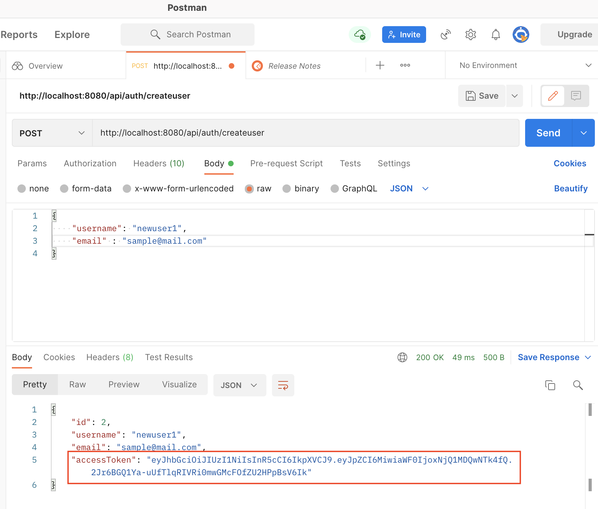
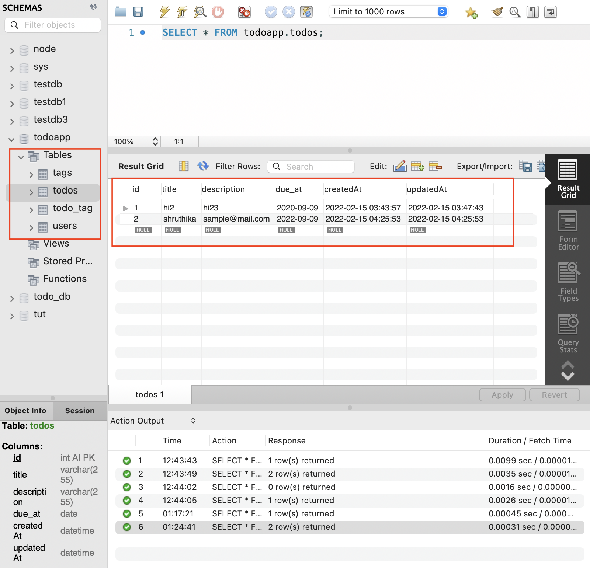
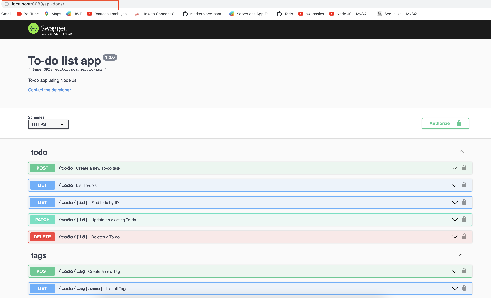

# TODO APP using REST API, Node.js, Express, Sequelize and MySQL + JWT Authentication
    
### Project setup
```
npm install
```

### Run
```
nodemon server.js
```

### Creating a user and returning access token


<br>


### SQL table storing todo's


<br>


### Swagger documentation at /api-docs


<br>
